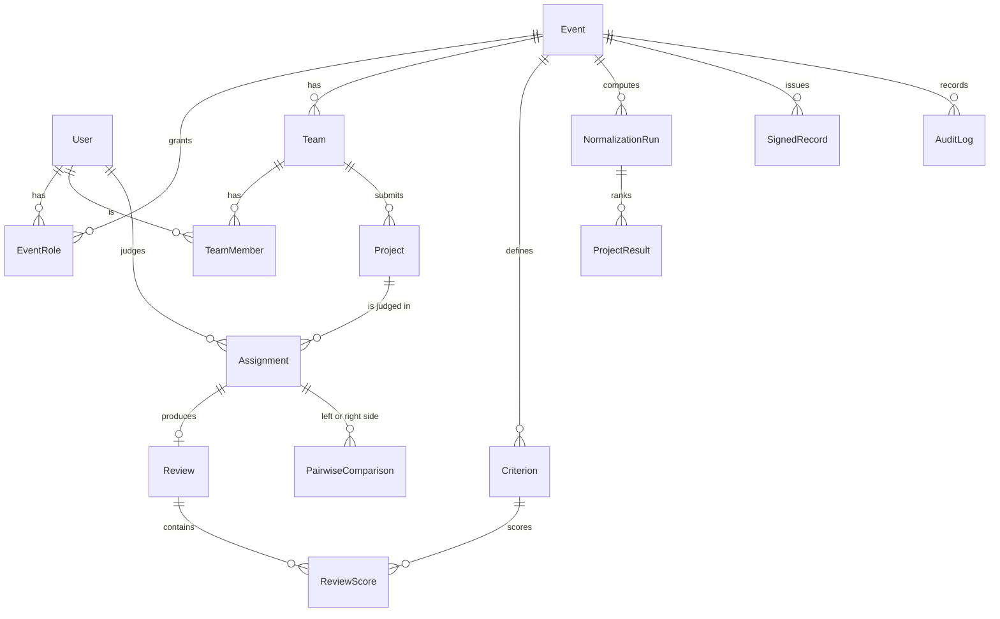

# Data model

PostgreSQL 16, managed with Prisma 6. The source of truth is [`apps/api/prisma/schema.prisma`](apps/api/prisma/schema.prisma), with 44 models, and [`apps/api/prisma/migrations/`](apps/api/prisma/migrations), with 21 migrations that run in order on every start.

**Design rule: the database refuses what must never happen, even if the code has a bug.** Wherever Prisma can't express such a rule, the migration adds it by hand as a CHECK constraint, a composite foreign key, a partial unique index or a trigger. §8 lists every one of them.

Conventions:
- **Ids:** UUIDs everywhere.
- **Time:** all timestamps are `timestamptz(3)`, in UTC.
- **Email:** stored lowercase; a CHECK enforces it.
- **Secrets:** stored only as SHA-256 hashes (sessions, API tokens, invites, reset and sign-in links, ballot codes). The one exception is webhook signing secrets; see [THREAT-MODEL.md](THREAT-MODEL.md).
- **Imported data** keeps its original ids in `externalId` (for example `prj_07` and `jdg_24`). These are unique per event, so the fixture's own ids work in URLs and exports.

---

## 1. People and access

```
User ─┬─< Session              (browser sign-in; token stored as a hash)
      ├─< ApiToken             (scripts; hash, scopes read/write, expiry, revocation)
      ├─< PasswordReset        (one-time links; also used for invited people to set a password)
      ├─< EventRole >── Event  (participant | judge | organizer, per event)
      └─< Notification
LoginLink                      (email sign-in links, keyed by email, not user)
```

| Model | Key fields | Notes |
|---|---|---|
| `User` | email, name, passwordHash?, isAdmin, handle?, profile fields, emailNotifications, mutedNotifications | `passwordHash` is null for invited or imported people until they set one (by emailed link only) |
| `Session` | tokenHash, userId, expiresAt, seeded | `seeded` marks the fixed demo sessions that `SEED_DEMO=false` deletes |
| `EventRole` | (eventId, userId, role), externalId? | A person can hold several roles; the rules about which combinations are allowed live in `policy.ts` |
| `ApiToken` | tokenHash, prefix, scopes[], expiresAt?, revokedAt?, lastUsedAt/Ip | CHECK: scopes ⊆ {read, write} and not empty |

**Roles are per event.** Being a judge at one event gives nothing at another. The admin flag is the only portal-wide role.

## 2. Events and their setup

| Model | Key fields | Notes |
|---|---|---|
| `Event` | slug, name, dates (registration, submissions, judging, voting), maxTeamSize, votingMode, votesPerVoter, commentsMode, pairwiseEnabled, publishedAt?, publishedRunId?, votingPublishedAt?, votingBallotsHash?, createdById? | `publishedAt` null means a private draft. `publishedRunId` null means results are hidden |
| `Track` | name, externalId? | Unique name per event |
| `Prize` | name, value, rank?, trackId? | `trackId` null means an overall prize (these set *k* for "chance of top k") |
| `SubmissionQuestion` / `ProjectAnswer` | label, type, required, isPublic | Organizer-defined submission form |
| `Announcement`, `FinderPost` | | Organizer updates and the team finder. One finder post per person per event |

CHECKs on `Event`:
- submissions open before they close;
- judging opens before it closes;
- voting opens before it closes;
- team size is 1–50;
- votes per voter are 1–20.

## 3. Teams and projects

```
Event ─< Team ─< TeamMember >─ User        (unique per event and user: one team per person per event)
          └─< TeamInvite                   (hash, maxUses, uses, expiry; CHECK 0 ≤ uses ≤ maxUses)
Team ─< Project >─ Track?
Project ─ duplicateOf ─> Project           (CHECK: never itself)
```

| Model | Key fields | Notes |
|---|---|---|
| `Project` | title, tagline, description, repo/demo/video URLs, thumbnail, techTags, status (draft, submitted, withdrawn, disqualified), submittedAt?, duplicateOfId? | Only `submitted` and non-duplicate projects appear in the gallery, get judged and can be voted for |

- **The deadline is enforced in the API** against the server clock. A refused late attempt is written to the audit log (`submission.refused_closed`).
- **Joining a team** locks the team's row, so two people racing for the last seat can't both get in.

## 4. Judging

```
Event ─< Criterion                              (weight > 0, minScore < maxScore)
Event ─< EventRole(judge) ─< JudgeTrack >─ Track
Event ─< ConflictOfInterest (judge × team)
Event ─< AssignmentBatch ─< Assignment (judge × project) ─ Review ─< ReviewScore >─ Criterion
Event ─< PairwiseComparison (judge; left and right project, each one of that judge's assignments)
Event ─< IntegrityResolution (flagKey → dismissed or confirmed, note, who)
```

| Model | Key fields | Notes |
|---|---|---|
| `Assignment` | judgeId, projectId, status (assigned, in_progress, submitted, recused), recusalReason?, openedAt?, batchId? | Unique (judge, project). `openedAt` feeds the "rushed review" check |
| `Review` | assignmentId, judgeId, projectId, status (draft, submitted), comment, submittedAt? | Tied to its assignment by a **composite foreign key** on (assignmentId, judgeId, projectId), so a review can't claim a different judge or project than its assignment |
| `ReviewScore` | (reviewId, criterionId), value | A trigger checks the value is inside the criterion's range, and that the criterion belongs to the review's event |
| `PairwiseComparison` | judgeId, leftProjectId, rightProjectId, pairKey, outcome (left, right, tie) | **Composite foreign keys** (judgeId, left) and (judgeId, right) point at `Assignment(judgeId, projectId)`: a judge can only compare two projects they were assigned. CHECKs: the two sides differ, and `pairKey` is the sorted pair. Unique per (judge, pair) |
| `AssignmentBatch` | algorithm, params, seed | Every auto-assignment keeps its inputs, so it can be reproduced |

## 5. Results

```
Event ─< NormalizationRun ─< ProjectResult
                         └─< JudgeStat
Event.publishedRunId ──> NormalizationRun
```

| Model | Key fields | Notes |
|---|---|---|
| `NormalizationRun` | method, params (λs, minReviews, excluded judges with reasons), weights, inputHash, componentCount, summary | **Immutable**: a trigger refuses UPDATE and DELETE. `inputHash` is a SHA-256 of every input that can change the result, so a run knows when the data has moved on (stale) |
| `ProjectResult` | nReviews, raw and normalized score, stdError, rank, rawRank, rankLow/High, pTop, flags | Immutable, like the run |
| `JudgeStat` | nReviews, rawMean, offset (leniency), stdDev, flags | Immutable, like the run |

Changing a result means saving a new run. Publishing points `Event.publishedRunId` at a run; the API allows that only after judging closes, and only for a run that isn't stale.

## 6. Community: voting and comments

```
Event ─< VoteInvite (ballot codes; hash)
Event ─< Voter (kind: email | accounts | invite; identityKey unique per event) ─ Ballot ─< BallotChoice >─ Project
Event ─< ProjectView (who opened which project, for the "voted without looking" signal)
Project ─< Comment (one level of replies) ─< CommentReport
```

| Model | Key fields | Notes |
|---|---|---|
| `Voter` | kind, userId?, inviteId?, identityKey, emailKey?, ip | A CHECK requires each kind to carry exactly its identity (an invite voter has an invite and a token; others have a user). `emailKey` is unique per event: one inbox, one vote, including `+tags` and Gmail dots |
| `Ballot` | receipt, status (counted, quarantined), quarantineReason? | Quarantine is reversible and audited. The receipt lets a voter confirm their ballot was counted |
| `BallotChoice` | (ballotId, projectId), position | A trigger checks that the project is from the ballot's own event, is submitted and not a duplicate, and that the ballot stays within `votesPerVoter` |
| `Comment` | body (CHECK 1–2000 characters), parentId?, hiddenAt/By/Reason, deletedAt | A trigger keeps replies one level deep and on the same project |

## 7. Integration, records and the audit log

| Model | Key fields | Notes |
|---|---|---|
| `Webhook` | url (CHECK http(s), ≤ 2000 characters), format (CHECK standard, slack or discord), secret (CHECK `whsec_…`), previousSecret + expiry (24 h rotation overlap), active, consecutiveFailures, failingSince, disabledReason | |
| `WebhookDelivery` | messageId, eventType, payload, status, attempts (CHECK 0–20), nextAttemptAt, lockedUntil | The **transactional outbox**: written in the same transaction as the change it reports |
| `WebhookAttempt` | statusCode?, error?, durationMs, responseBody (truncated) | The delivery log organizers see |
| `SigningKey` | kid, algorithm (Ed25519), publicKeyPem, retiredAt? | Public halves only. The private key is a file on its own volume |
| `SignedRecord` | type (`judge_participation` or `participation`, the participant certificate), statement (canonical JSON), signature, kid, issuedAt, revokedAt?, supersededById? | **Append-only**: a trigger refuses changes to anything that was signed, direct deletes, and undoing a revocation. A partial unique index allows one current record per (event, person, type) |
| `AuditLog` | action, entityType/Id, before, after, actor, ip, requestId, prevHash, hash | **Hash chain**: `hash = sha256(prevHash + canonical row)`. Triggers refuse UPDATE, DELETE and TRUNCATE. `npm run audit:verify` re-hashes the whole chain |
| `Notification` | category, title, url, key? (unique: each reminder is sent once), readAt, emailWanted, emailedAt | Also the email outbox for notification emails |
| `Upload` | sha256, mimeType, sizeBytes | Files are content-addressed on the uploads volume |

## 8. Rules the database enforces itself

Everything here is refused by PostgreSQL even if the API has a bug. Integration tests check several of them directly (for example, `integration/judging-setup.test.ts` inserts an out-of-range score, and `integration/pairwise.test.ts` inserts a malformed pair).

| Rule | Mechanism | Migration |
|---|---|---|
| Emails are lowercase | CHECK | `init` |
| Submission and judging windows are ordered; team size 1–50 | CHECK | `init` |
| Criterion weight > 0; min < max | CHECK | `init` |
| Invite uses between 0 and maxUses | CHECK | `init` |
| A project is never its own duplicate | CHECK | `init` |
| A score is inside its criterion's range, and the criterion belongs to the event | trigger `review_score_check` | `init` |
| A review matches its assignment's judge and project | composite FK | `init` |
| An assignment's project belongs to the assignment's event | composite FK on (projectId, eventId) | `init` |
| The audit log can't be updated, deleted or truncated | triggers | `init` |
| Results runs, project results and judge stats never change | triggers `*_immutable` | `results_immutable` |
| A ballot choice is an eligible project of the same event; ballots stay within the vote cap | trigger `ballot_choice_check` | `community_voting` |
| Each voter kind carries exactly its identity; the voting window is ordered; 1–20 votes | CHECK | `community_voting` |
| Replies are one level deep and on the same project; comment length 1–2000 | trigger, CHECK | `project_comments` |
| API token scopes ⊆ {read, write}; names 1–60 characters | CHECK | `api_tokens` |
| Webhook URL is http(s); secret format; format ∈ {standard, slack, discord}; attempts ≤ 20 | CHECK | `webhooks`, `webhook_formats` |
| Signed statements never change; revocations can't be undone; one current record per person, event and type | trigger, partial unique index, deferrable FK | `signed_records` |
| Profile handles are lowercase, 3–30 characters, with no leading or trailing dash | CHECK | `profiles` |
| A comparison is between two of the judge's own assignments, two different projects, stored once | composite FKs, CHECKs, unique | `pairwise` |

## 9. What isn't enforced in the database, and where it is

- **Permissions.** Who may read or change what lives in `apps/api/src/policy.ts`. It's unit-tested as a table (`unit/policy.test.ts`) and tested from outside by calling every route as every excluded persona (`integration/access-matrix.test.ts`).
- **Time windows** (deadlines, judging and voting open or closed) are checked by the API against the server clock. The database stores the dates and their order, but not "now".
- **One live project per team** is enforced in the API (creating a second draft is refused), not by an index.

## 10. Diagram (core)


